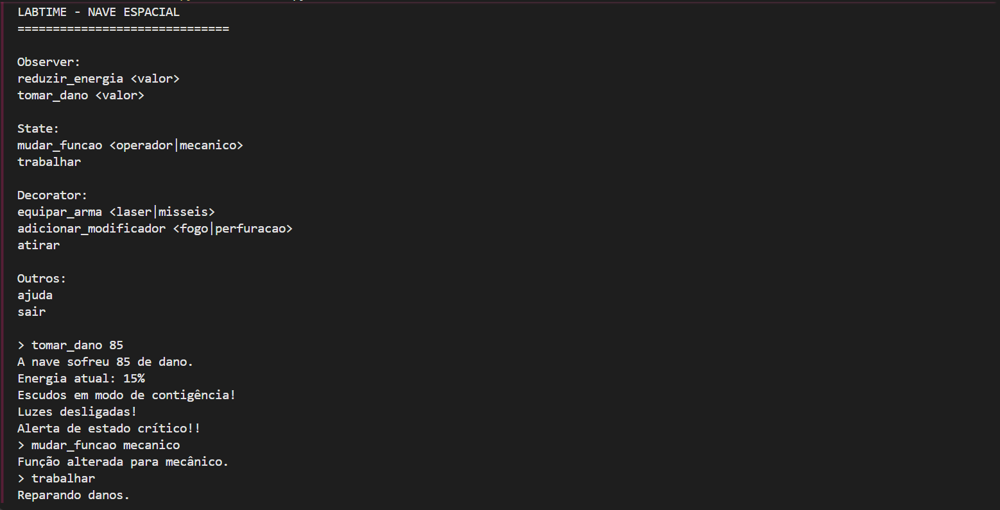
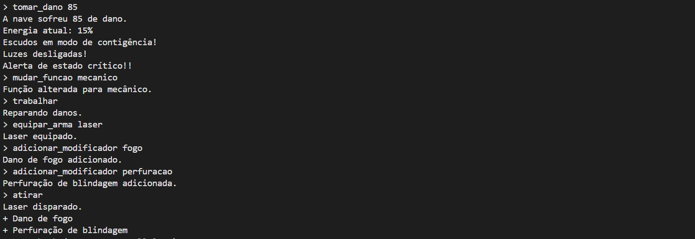

# Desafio Técnico - LabTIME 2026

Isadora Costa Nascimento

Implementação dos padrões de projeto Observer, State e Decorator para simular diferentes sistemas de uma nave espacial.

## Tecnologias utilizadas

- Python 3

---

# Estrutura do projeto

```
.
├── core
│   └── energy_core.py
├── observer
│   ├── observer.py
│   ├── shield.py
│   ├── lights.py
│   └── panel.py
├── crew
│   ├── crew_member.py
│   ├── state.py
│   ├── gunner.py
│   └── engineer.py
├── ship
│   └── spaceship.py
├── weapons
│   ├── weapon.py
│   ├── decorator.py
│   ├── laser.py
│   ├── missile.py
│   ├── fire.py
│   └── armor.py
└── main.py
```

---

# Ticket 1 - Sistema de Contingência do Núcleo da Nave

## Padrão utilizado

**Observer**

## Justificativa

O padrão Observer foi escolhido porque o núcleo da nave não pode conhecer diretamente os sistemas que dependem dele.

Quando a energia é alterada, o núcleo apenas envia uma notificação para todos os observadores cadastrados.

Novos sistemas podem ser adicionados sem modificar a classe principal.

## Papéis das classes

| Classe | Papel |
| --- | --- |
| EnergyCore | Subject |
| EnergyObserver | Observer |
| Shield | Observer concreto |
| Lights | Observer concreto |
| Panel | Observer concreto |

---

# Ticket 2 - Comportamento Dinâmico da Tripulação

## Padrão utilizado

**State**

## Justificativa

O padrão State foi escolhido porque o comportamento do tripulante precisa mudar durante a execução do programa.

A troca de função acontece sem destruir o objeto principal e sem utilizar estruturas condicionais extensas.

## Papéis das classes

| Classe | Papel |
| --- | --- |
| CrewMember | Context |
| CrewState | State |
| Gunner | Estado concreto |
| Engineer | Estado concreto |

---

# Ticket 3 - Armamento Modular e Modificadores Piratas

## Padrão utilizado

**Decorator**

## Justificativa

O padrão Decorator foi escolhido porque os modificadores precisam ser adicionados dinamicamente às armas.

Essa abordagem evita a criação de uma nova classe para cada combinação possível de modificadores.

## Papéis das classes

| Classe | Papel |
| --- | --- |
| Weapon | Componente |
| Laser | Componente concreto |
| Missile | Componente concreto |
| WeaponDecorator | Decorator |
| FireDamage | Decorator concreto |
| ArmorPenetration | Decorator concreto |

---

# Como executar o projeto

## Clonar o repositório

```bash
git clone <https://github.com/isadoraacosta/labtime-desafio.git>
```

## Entrar na pasta

```bash
cd <labtime-desafio>
```

## Executar o projeto

```bash
python main.py
```

---

# Comandos disponíveis

```text
reduzir_energia <valor>

tomar_dano <valor>

mudar_funcao <operador|mecanico>

trabalhar

equipar_arma <laser|misseis>

adicionar_modificador <fogo|perfuracao>

atirar

ajuda

sair
```

---

# Exemplo de execução

```text
> tomar_dano 85

A nave sofreu 85 de dano.
Energia atual: 15%

Escudos em modo de contingência!
Luzes desligadas!
Alerta de estado crítico!

> mudar_funcao mecanico

Função alterada para mecânico.

> trabalhar

Reparando danos.

> equipar_arma laser

Laser equipado.

> adicionar_modificador fogo

Dano de fogo adicionado.

> adicionar_modificador perfuracao

Perfuração de blindagem adicionada.

> atirar

Laser disparado.
+ Dano de fogo.
+ Perfuração de blindagem.
```

---

# Evidências

Abaixo estão alguns exemplos da execução do sistema no terminal.

## Testes gerais

### Execução do programa




 
 

---